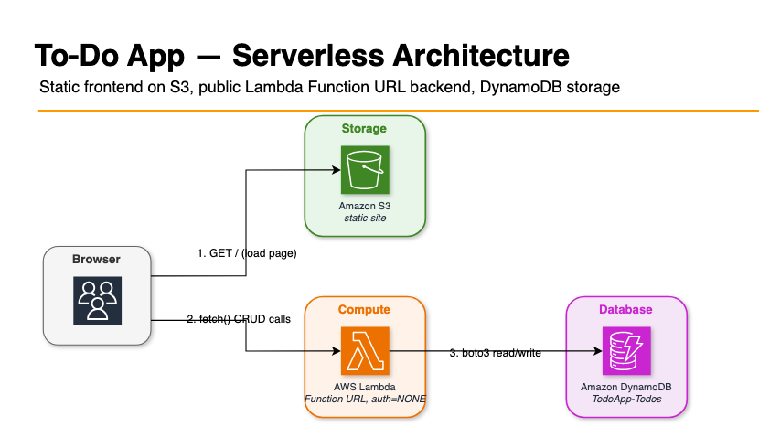

# To-Do App — Serverless AWS Demo

A small full-CRUD to-do list running entirely on S3, Lambda, and DynamoDB — no server to
manage, no framework, no build step.

## Architecture



- **Browser** loads the static site from **S3** once, then calls the **Lambda Function URL**
  directly for every create/read/update/delete.
- The Function URL is public (`AuthType=NONE`) but **CORS-restricted** to the exact S3 origin —
  no server-side session, no API Gateway in front.
- **Lambda** (Python, `boto3`, no framework) routes on HTTP method + path and does one
  DynamoDB operation per request.
- **DynamoDB** (`TodoApp-Todos`, on-demand billing) is the only state. No cache, no queue.

## Repo structure

```
backend/handler.py   Lambda handler — routes on method+path, one function per CRUD op
frontend/             static site: index.html, style.css, app.js, config.js (generated)
deploy.sh             idempotent AWS CLI deploy script (no SAM/CDK)
assets/               architecture diagram (source .drawio + exported .png)
LESSON_LEARNED.md     real bugs hit during development — root cause, fix, takeaway
```

## Key features

Full CRUD (create, list, toggle-complete, delete) plus filter tabs (All/Active/Completed) and
clear-completed. The frontend hides network latency instead of showing it:

- **Optimistic toggle** — the checkbox flips and the row re-renders *before* the network
  request resolves; only rolls back if the `PATCH` actually fails.
- **Delete-with-undo, zero-cost undo** — deleting a row hides it and shows a toast instantly;
  the real `DELETE` call is delayed 5s, so clicking "Undo" costs nothing over the network — it
  just cancels a timer.
- **Local-first re-render** — every mutation updates in-memory state and re-renders
  immediately; the backend response is used to confirm or correct, never to gate the UI.

## Known limitations

- **No auth.** The Lambda Function URL is public (`AuthType=NONE`) — this is a single shared
  to-do list, not per-user. CORS locks out other *browser* origins, but `curl` bypasses it
  entirely.
- **No rate limiting** on the public write endpoints.
- **Unpaginated `Scan`** for `GET /todos` — fine at demo scale, would need pagination past
  ~1MB of items.
- **Not atomic:** `toggle_todo`/`delete_todo` do a `get_item` then a separate
  `update_item`/`delete_item` — a narrow race window if the same item is hit concurrently.

## Deploying

```
./deploy.sh
```

Requires AWS CLI configured (`aws configure`) with S3/Lambda/DynamoDB/IAM permissions.
Idempotent — safe to re-run; creates missing resources, updates Lambda code and CORS config in
place otherwise. Prints the live site URL at the end.

## Further reading

[`LESSON_LEARNED.md`](LESSON_LEARNED.md) — the real bugs (a Lambda Function URL permissions
change, a CSS `hidden`-attribute override, a missing-field crash, and more) found and fixed
during development, with root cause and takeaway for each.
